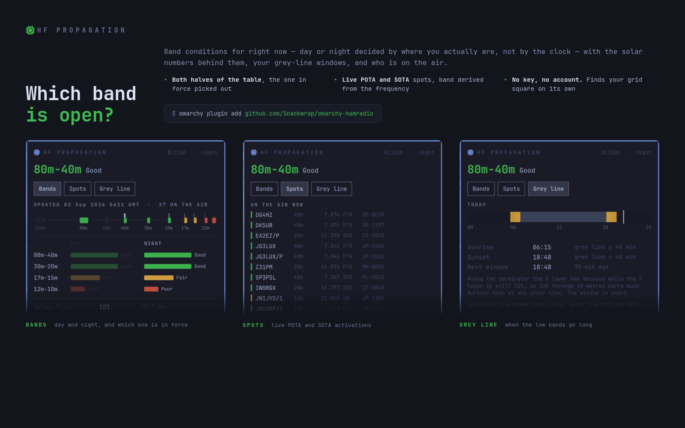

# Ham Radio — Omarchy bar plugin



Which band is open, in the [Omarchy](https://omarchy.org) (Quattro) bar. Click
it for the full day/night table with the solar numbers behind it, your grey-line
windows on a 24-hour strip, and who is on the air right now.

No API key, no account, no callsign required. It works out your grid square from
the location your Omarchy weather widget already knows.

## The three tabs

- **Bands** — the HF spectrum from 1.8 to 30 MHz, every band drawn at its real
  place and filled with the grade in force, and the frequencies people are
  working right now as ticks on the same axis. Under it, N0NBH's verdict for
  each band group day and night side by side, with the half actually in force
  picked out and the other dimmed; then the numbers that produced it — solar
  flux, sunspot number, A and K, the X-ray class, foF2 and the signal-noise
  estimate.
- **Spots** — live POTA and SOTA activations, newest first, each row coloured by
  what that band is doing right now, with the band derived from the spotted
  frequency rather than trusted from the feed. Filter it to the bands you can
  actually work.
- **Grey line** — today as a strip: night dark, day light, and the two grey-line
  windows picked out in amber, with a marker for now. Sunrise, sunset, and how
  long until the next window.

## Why day and night both matter

Propagation is not a property of the hour, it is a property of whether the sun is
up **where you are standing**. The same band group is graded twice, and this
plugin picks the half that applies by computing sunrise and sunset for your own
coordinates — which is also what makes the grey line calculable.

The grey line is the band of twilight sweeping round the earth. Along it the D
layer, which absorbs the low bands by day, has decayed while the F layer is still
lit, so 160 through 40 metres carry much further than at any other time. The
window is short — roughly forty minutes either side — which is exactly why it is
worth a bar widget telling you about it.

## What is checked, and against what

The rules live in `ham.js` with no Qt types in them, so `tools/test-ham.mjs` runs
the same code under node and checks it against published references rather than
against itself:

- **Maidenhead locators** against the canonical worked examples — W1AW in
  Newington is `FN31pr`, the prime meridian at the equator is `JJ00aa` — plus
  round-trips through `gridToLatLon`.
- **The band plan** with a real frequency from each band's most-used segment,
  including the fact that POTA sends kHz as a string and SOTA sends MHz as a
  number, so `"7074.0"` and `7.14` must both come out as 40m.
- **Sunrise and sunset** against real times for a known place and date, and the
  polar day and polar night cases at 78° N.
- **The solar feed** against a fixture, including that a MUF reported as `NoRpt`
  must not become a number.
- Then, live: the real feed has to parse, the flux has to be plausible, every
  band grade has to be a word we know, and nearly every spotted frequency has to
  land in a band. Only *nearly* — operators mistype frequencies and the feed
  passes them through, so a spot at 700.5 MHz is a fat finger rather than a band
  we are missing, and refusing to map it is the right behaviour.

```bash
node tools/test-ham.mjs            # includes the live checks
node tools/test-ham.mjs --offline  # rules only
```

## Requirements

- Omarchy **Quattro (v4)** with `omarchy-shell` (Quickshell-based bar)
- `curl` on `PATH`
- A Nerd Font in the bar (Omarchy ships one) for the glyph

## Install

```bash
omarchy plugin add https://github.com/Snackwrap/omarchy-hamradio.git --enable
omarchy bar move com.leafbox.hamradio right
```

## Uninstall

```bash
omarchy plugin disable com.leafbox.hamradio
omarchy plugin remove com.leafbox.hamradio
omarchy restart shell
```

## Settings

Omarchy has no settings UI for bar widgets yet — the manifest declares a schema
for the one that is coming. Until then, set any key from the table below with:

```bash
omarchy bar set com.leafbox.hamradio grid IO91px
omarchy restart shell
```

| Setting | Key | Does |
|---|---|---|
| Locator | `grid` | Maidenhead square, e.g. `IO91px`. Blank uses your weather location |
| Latitude / longitude | `latitude`, `longitude` | Override the locator |
| Bar pill shows | `pillContent` | `band`, `sfi`, `k` or `spots` |
| Spots from | `spotSource` | `both`, `pota`, `sota` or `off` |
| Band filter | `spotBands` | e.g. `40m,20m`. Blank shows all |
| Default tab | `defaultTab` | `bands`, `spots` or `greyline` |
| Grey-line notification | `greyLineAlert` | Off by default |
| Times | `timeFormat` | `local` or `utc` |
| Animations | `animations` | The band bars and the grey-line strip |
| Popup position | `popupPosition` | `icon` or `center` |

## How it works

- `BarWidget.qml` — the bar-slot button and popout-identity shim.
- `Panel.qml` — fetches and renders.
- `ham.js` — every rule: locators, the band plan, the solar feed reader, grade
  ranking, sunrise/sunset and the grey line, distance and bearing, and spot
  normalising. Free of Qt types so it can be tested under node.
- `BandTable.qml` — the day/night matrix. Grades are drawn as bar lengths as
  well as colours, because three lengths read faster than three words and the
  colour then only has to confirm it.
- `Spectrum.qml` — the frequency axis. Logarithmic, because linear would give
  10m nearly half the width and squeeze 160m through 40m into the first fifth.
  A band with no published grade is drawn as an outline rather than borrowing a
  neighbour's verdict — 160m behaves nothing like 40m.
- `GreyLineStrip.qml` — today as a 24-hour strip.
- `tools/capture-preview.sh` — regenerates the listing card. The popup lives in
  a fullscreen layer surface, so the compositor cannot report where it is; with
  `debugGeometry` set the panel prints its own frame and the capture crops to
  exactly that. Each shot is then checked for the popup's uniform border,
  because a photograph of the window underneath looks like a success otherwise.

## Handling of remote data

Everything here is fetched from the public internet and displayed, so:

- Requests are pinned to `--proto =https` and bounded twice — `--max-filesize`
  on the producer, and a matching refusal before parsing, since a chunked
  response carries no `Content-Length` for curl to check.
- Collections are capped where they are ingested, not where they are drawn.
- Every `Text` is `textFormat: Text.PlainText` and every remote value is
  stripped of control characters and length-clamped first. Qt's default
  `AutoText` renders a string as *rich* text when it looks like markup.
- Each request carries a generation; a response whose stamp no longer matches
  is discarded rather than accepted late.
- A watchdog holds an independent deadline over every fetch, because
  `--max-time` is curl's own clock.
- The location file is read through a bounded, time-limited reader rather than
  `FileView.text()`, which has no size cap and would block on a planted FIFO.

## Data and disclaimer

Band conditions and solar values come from **N0NBH** via
[hamqsl.com](https://www.hamqsl.com/), spots from the
[POTA](https://pota.app) and [SOTA](https://www.sota.org.uk) APIs. None require
a key.

Band condition grades are a model, not a measurement — the only way to know a
band is open is to listen. Nothing here is a substitute for your own ears.

## License

MIT. Not affiliated with or endorsed by N0NBH, POTA, SOTA, or the ARRL.
